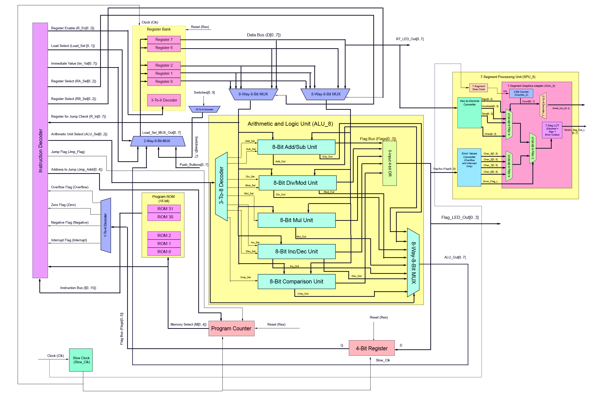

# Nanoprocessor

A nanoprocessor capable of executing a set of simple instructions.

# Features

- 8-bit registers
- 16 16-bit instructions
- 7-segment processing unit
- 32 instructions can be stored in ROM
- Flags for overflow, zero, negative, and interrupt

## Schematic



</br>

## Instruction set

<!-- Disable word wrap to display table correctly-->

| Instruction | Description                                                                                                                                                                  | Machine Code (16-bit)                   | Flags Set                 |
| ----------- | ---------------------------------------------------------------------------------------------------------------------------------------------------------------------------- | --------------------------------------- | ------------------------- |
| `MOVI R d`  | Move immediate value d to register `R`                                                                                                                                       | `0 0 1 0 R[0..2] 0 d[0..7]`             | -                         |
| `ADD RA RB` | Add values in registers `RA` and `RB` and store the result in `RA`                                                                                                           | `0 0 0 0 RA[0..2] RB[0..2] 0 0 0 0 0 0` | Zero, Oveflow, Negative   |
| `NEG R`     | Two’s complement of register `R`                                                                                                                                             | `0 0 0 1 R[0..2] 0 0 0 0 0 0 0 0 0`     | Zero, Negative            |
| `JZR R d`   | Jump to address `d` if value in register R is 0                                                                                                                              | `0 0 1 1 R[0..2] 0 0 0 0 d[0..4]`       | -                         |
| `MOV RA RB` | Move value in register `RB` to `RA`                                                                                                                                          | `0 1 0 0 RA[0..2] RB[0..2] 0 0 0 0 0 0` | -                         |
| `MUL RA RB` | Multiply value in `RA` with value in `RB` and store the result in `RA`                                                                                                       | `0 1 0 1 RA[0..2] RB[0..2] 0 0 0 0 0 0` | Zero, Overflow, Negative  |
| `DIV RA RB` | Divide value in `RA` by value in `RB` and store the result in `RA`. If value in `RB` is zero `Interrupt` flag is set by ALU                                                  | `0 1 1 0 RA[0..2] RB[0..2] 0 0 0 0 0 0` | Zero, Negative, Interrupt |
| `MOD RA RB` | Calculate mod of value in `RA` with value in `RB` and store the result in `RA`. If value in `RB` is zero `Interrupt` flag is set by ALU                                      | `0 1 1 1 RA[0..2] RB[0..2] 0 0 0 0 0 0` | Zero, Negative, Interrupt |
| `IN R P`    | Take input from port `P` and store the result in register `R`. Port 0 is maps to Switches and port 1 maps to push buttons.                                                   | `1 0 0 0 R[0..2] 0 0 0 0 0 0 0 0 P`     | -                         |
| `CMP RA RB` | Compare value in `RA` with value in `RB` and if the values are equal `Zero` flag is set, if RA is less than RB `Negative` flag is set, otherwise set no flags are set by ALU | `1 0 0 1 RA[0..2] RB[0..2] 0 0 0 0 0 0` | Zero, Negative            |
| `JZ d`      | Jump to address `d` if `Zero` flag is set                                                                                                                                    | `1 0 1 0 0 0 0 0 0 0 0 d[0..4]`         | -                         |
| `JO d`      | Jump to address `d` if `Overflow` flag is set                                                                                                                                | `1 0 1 1 0 0 0 0 0 0 0 d[0..4]`         | -                         |
| `JS d`      | Jump to address `d` if `Negative` flag is set                                                                                                                                | `1 1 0 0 0 0 0 0 0 0 0 d[0..4]`         | -                         |
| `JINT d`    | Jump to address `d` if `Interrupt` flag is set                                                                                                                               | `1 1 0 1 0 0 0 0 0 0 0 d[0..4]`         | -                         |
| `INC R`     | Increment value in register `R`                                                                                                                                              | `1 1 1 0 R[0..2] 0 0 0 0 0 0 0 0 0`     | Zero, Negative, Overflow  |
| `DEC R`     | Decrement value in register `R`                                                                                                                                              | `1 1 1 1 R[0..2] 0 0 0 0 0 0 0 0 0`     | Zero, Negative, Overflow  |

Flags[0] -> Overflow
Flags[1] -> Zero
Flags[2] -> Negative
Flags[3] -> Interrupt

## Compiler

The compiler is used to compile instructions written in `.asm` format to machine code. The usage of the compiler is described below.

Open up the terminal and go the `compiler` folder.

```
cd compiler
```

Compile instruction file to machine code with python.

```
python compiler.py test.asm
```

Machine code will be written to a text file with the same name as the input source file.

### Assembly Syntax

The syntax for the assembly files is quite simple. The available instructions are described in the instruction set table. Registers are named from R0 to R7. Literal values are in hexadecimal. Comments can be added with the `;` symbol. See `test.asm` for an example.
